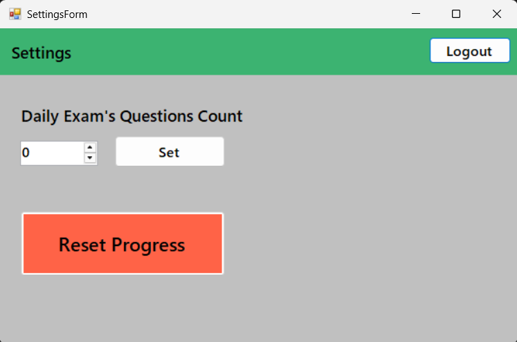
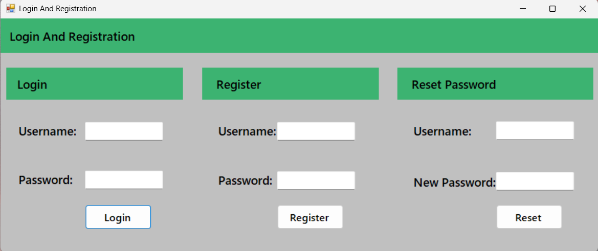
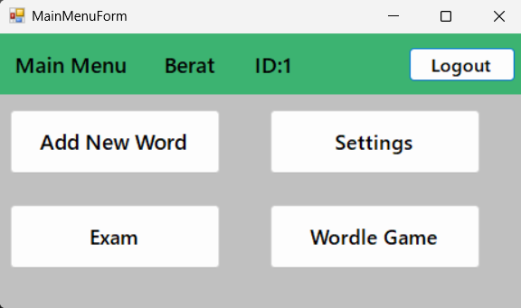
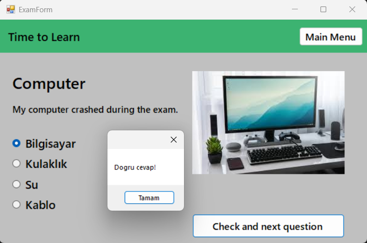
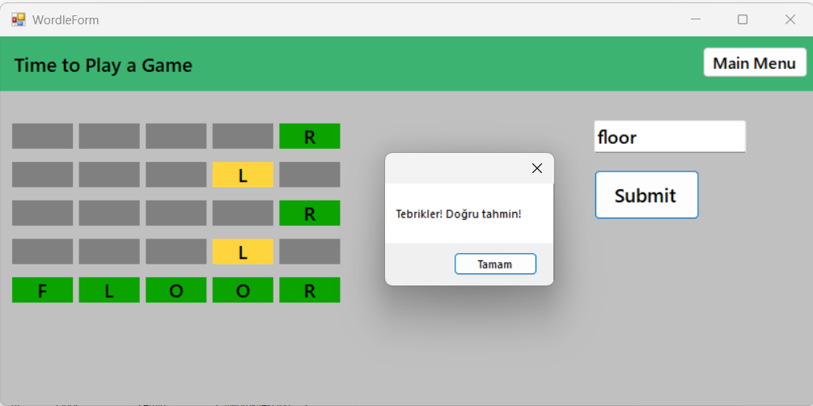
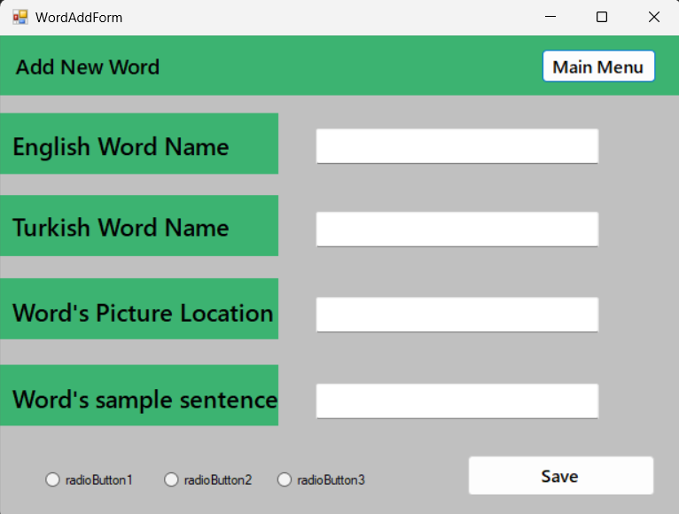

# 🧠 Word Memorizing Game - 6 Sefer Tekrar Prensibi

Bu proje, **Scrum metodolojisi** ile geliştirilen ve “6 Sefer Tekrar Prensibi”ne dayalı bir kelime ezberleme oyunudur. Amaç, kullanıcıların kelimeleri kalıcı biçimde öğrenmesini sağlamak ve bu süreci veri tabanı ile takip etmektir.

## 📚 Proje Hikayesi

Kullanıcılar, İngilizce kelimeleri Türkçe anlamları, örnek cümleleri, görselleri ve tercihe bağlı sesli telaffuzlar ile öğrenir. Bir kelimenin kalıcı olarak öğrenilmesi için **6 farklı zaman diliminde** doğru yanıtlanması gerekir:  
📅 1 gün → 1 hafta → 1 ay → 3 ay → 6 ay → 1 yıl

Bu sistem “ezberleyip unutma” yerine, **tekrar ederek öğrenme** üzerine kuruludur.

---

## 🚀 Özellikler (User Stories)

| ID  | Story Açıklaması                                                                 | Durum  |
|-----|----------------------------------------------------------------------------------|--------|
| 1   | Kullanıcı kayıt, giriş ve "şifremi unuttum" sistemi                              | ✅     |
| 2   | Kelime ekleme (metin, resim, örnek cümle, opsiyonel ses)                         | ✅     |
| 3   | 6 sefer tekrar algoritması ile çalışan sınav modülü                              | ✅     |
| 4   | Ayarlar ekranı (günlük gösterilecek kelime sayısı belirleme)                     | ✅     |
| 5   | Kullanıcı bazlı analiz raporu ve çıktı alma özelliği                             | ✅     |
| 6   | Bulmaca (wordle tarzı, öğrenilen kelimelerle)                                    | ✅     |
| 7   | Word Chain (LLM ile hikaye ve görsel üretimi - opsiyonel)                        | ❌     |

---

## 🛠️ Teknolojiler

- C# (.NET Framework - WinForms)
- MySQL
- Entity Framework
- Gömülü medya desteği (resim, ses)
- Opsiyonel: OpenAI API (LLM desteği için)

---

## 🧪 6 Sefer Tekrar Algoritması

> Bir kelimeyi **kalıcı** öğrenmek için, kullanıcı 6 farklı zamanda da doğru cevaplamalıdır.  
> Yanlış cevap verilirse, sayaç sıfırlanır ve süreç başa döner.

Tarihe bağlı otomatik kelime seçimi algoritması uygulanmıştır.

---

## 📈 Analiz Modülü

- Kullanıcının bildiği/bilmediği kelimeler
- Konu bazlı başarı yüzdesi
- Zaman serisi üzerinden performans değişimi
- Grafiksel gösterim ve çıktı alma (PDF/Excel)

---

## 🧩 Veritabanı Yapısı

**Users**  
- `UserID`, `UserName`, `Password`

**Words**  
- `WordID`, `EngWordName`, `TurWordName`, `Picture`

**WordSamples**  
- `SampleID`, `WordID`, `Samples`

**WordProgress**  
- `ProgressID`, `UserID`, `WordID`, `CorrectCount`, `LastCorrectDate`, `NextTestDate`, `IsLearned`

---

## 🧾 Kurulum Talimatları

1. Bu repoyu klonla:
   ```bash
   git clone https://github.com/devberatzengin/Word-Memorizing-Game.git
   ```
2. Visual Studio ile aç.
3. MySQL üzerinde `db_WordGame` isimli veritabanını oluştur.
4. `app.config` veya `appsettings.json` içerisindeki bağlantı cümlesini kendi MySQL ayarlarına göre düzenle.
5. Uygulamayı çalıştır ve giriş yap!

---
## 📸 Ekran Görüntüleri

### 🔨 Scrum Table


### 🔐 Giriş Ekranı


### 🏠 Ana Menü


### 📝 Sınav Arayüzü


### ⚙️ Ayarlar Sayfası


### 🏫 Wordle Sayfası


### ➕ Word Adding Sayfası


---

## 🧠 Kimin Ne Yaptığı

- 👤 **@devberatzengin** – Student Developer & Proje Sahibi

---

## 🧪 Değerlendirme Notları

| Kriter                    | Durum |
|---------------------------|-------|
| KISS prensiplerine uygun  | ✅    |
| Code Smell yok/az         | ✅    |
| Scrum table (Trello)      | ✅    |
| Git commit geçmişi        | ✅    |
| Help doküman (README.md)  | ✅    |
| Video gönderimi           | 🔜    |
| Mobil APK desteği         | ❌    |

---

## 🎁 Ekstra Özellikler

- [x] Kelime şıkları rastgele
- [x] Soruları boş bırakma ve geri dönme
- [x] Zorluk seviyesine göre filtreleme
- [ ] Sınav sorumlusu ekranı (yolda)

---

## 📄 Lisans

Bu proje eğitim ve geliştirme amaçlıdır. İzinsiz kopyalanamaz.
